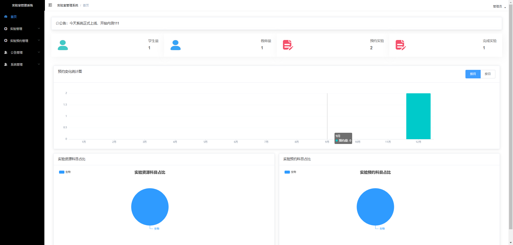

# 基于Java+SpringBoot+Vue实验室管理系统(源码+数据库)

#### 作者QQ：3275035005 微信：xkbishe123 (支持修改、 部署调试、 代做接毕业设计和课程设计)

#### 网站建设、小程序、H5、APP、各种系统、样式修改、10000套源码可选。

#### 选题+开题报告+任务书+程序定制+安装调试+论文+答辩ppt 都可以做

#### 问题包修改，包满意，有需求尽管甩过来！一条龙帮你安心过！

#### 所有项目以及源代码本人均调试运行无问题 可支持远程调试运行

# 项目介绍
基于Java+SpringBoot+Vue实验室管理系统-毕业设计，本系统分为三个角色学生、教师、管理员，项目采用前后端分离开发

### 1. 学生

登录、首页数据统计、实验预约、参加实验、查看我的预约、密码修改、个人信息修改、退出登录 

### 2. 教师

登录、首页数据统计、实验评估管理、密码修改、个人信息修改、退出登录

### 3. 管理员

登录、首页数据统计、实验资源管理、实验试题管理、实验预约管理、公告管理、用户信息管理、密码修改、个人信息修改、退出登录 

# 技术框架
- 开发语言：Java
- 数据库：Mysql5.7以上
- 系统环境：jdk8、maven、node
- 后端框架：SpringBoot、MyBatis
- 前端框架：Vue、ElementUI
- 工具：IDEA、Navicat
- 技术架构：前后端分离、B/S架构、MVC架构
# 项目截图

### 1. 学生端

### 2. 教师端

### 3. 管理员端

